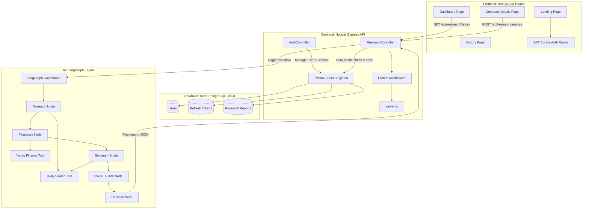

# System Architecture: AI Investment Research Agent

This document defines the system components, data flow, security model, and structural layout of the AI Investment Research Agent.

## System Components

### 1. Frontend (Next.js App Router)
- **Role**: Displays landing pages, dashboards, financial charts, search forms, and historical reports.
- **Tech Stack**: Next.js (TypeScript), React, Tailwind CSS, shadcn/ui, Framer Motion, Recharts.
- **Session Control**: Authentic credentials stored inside secure HttpOnly cookies, automatically attached to outgoing backend requests.

### 2. Backend (Express API Server)
- **Role**: Coordinates route security, DB calls, caching daily analysis, and triggers the AI Agent graph.
- **Tech Stack**: Express.js (TypeScript), Prisma ORM, CORS, Helmet, express-rate-limit.
- **Session Auth**: JWT verification middleware reading headers/cookies.

### 3. Database Layer (PostgreSQL)
- **Role**: Stores persistent user records, refresh session tokens, and compiled company reports.
- **Schema Management**: Managed via Prisma ORM targeting Neon Cloud PostgreSQL database.

### 4. AI Orchestration Service (LangGraph & LangChain)
- **Role**: Runs a multi-agent state-machine loop that gathers research, extracts financial metrics, searches for recent news, evaluates SWOT models, and issues the final recommendation.
- **Tools**: Tavily Search API, Yahoo Finance NPM wrapper (`yahoo-finance2`).
